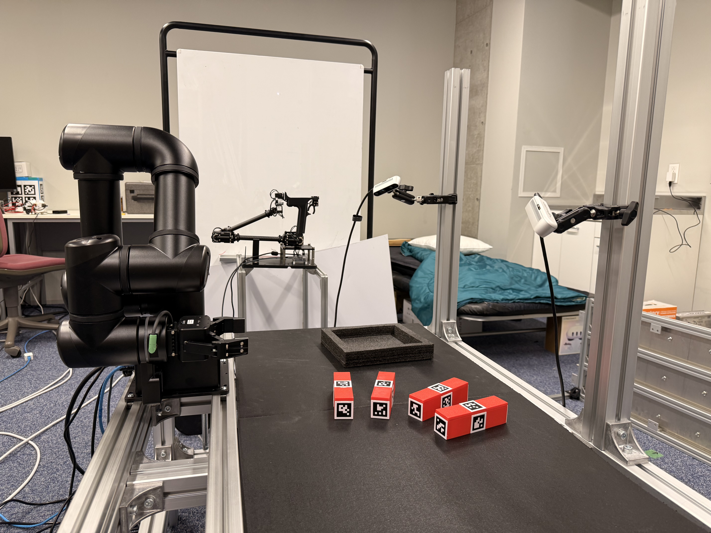

# Technical Report

## Hardware setup 

OpenManipulator Y Leader-Follower system from ROBOTIS: 

* Degree of Freedom: 6
* Software: [ROS2 Jazzy package](https://github.com/ROBOTIS-GIT/open_manipulator) 
* Controller: built-in controller in joint space + custom controller in Cartesian space

## Data Collection

### Setup:

Cameras:

* **Wrist Camera**: Intel Realsense D405 (480x848 @ 15fps)
* **Scene Camera 1**: Intel Realsense D435 (480x640 @ 15fps)
* **Scene Camera 2**: Intel Realsense D435i (480x640 @ 15fps)

Human operator uses the leader device to demonstrate motions and the follower will replicate the exact motions.

### Recording
Images from all 3 cameras and joint position data are published via ROS2.

There is a web-based UI to streamline the recording process. The UI interacts with ROS2 underthehood. The recording frequency can be controlled via the UI. We have tried recorded the data in 10 and 30Hz.

### Data format
The data is saved in [Lerobot](https://github.com/huggingface/lerobot) dataset format.

* **observation.states**: 7D vector, includes the 6 joint angles or the absolute pose of the follower + the gripper state
* **action**: 7D vector, the state in the next timestep
* **observation.images.cam_wrist**: `480x848x3` image
* **observation.images.cam_scene1**: `480x640x3` image
* **observation.images.cam_scene2**: `480x640x3` image

Some dataset we have collected. You can click on the link to see the visualization

* [Pushing + Grasping](https://huggingface.co/spaces/lerobot/visualize_dataset?path=%2Fhieu1344%2Fomy_baseline%2Fepisode_0) 
* [Pushing only](https://huggingface.co/spaces/lerobot/visualize_dataset?path=%2Fhieu1344%2Fomy_pushing%2Fepisode_0%3Ft%3D21)
* [Pushing only with absolute pose](https://huggingface.co/spaces/lerobot/visualize_dataset?path=%2Fhieu1344%2Fomy_pushing_with_pose_pd_10fps%2Fepisode_0%3Ft%3D15)
* [Pushsing with 2 cam](https://huggingface.co/spaces/lerobot/visualize_dataset?path=%2Fhieu1344%2Fomy_push_2_obj_2cam%2Fepisode_0%3Ft%3D10)

## Model training
We used [Diffusion Policy](https://diffusion-policy.cs.columbia.edu/diffusion_policy_2023.pdf) as the model for imitation learning. All hyperparamerters was set the same as in [Learning to Push, Group, and Grasp](https://arxiv.org/pdf/2502.08452) and we used the Lerobot codebase for training
* All 3 images resize to: 240x320
* Learning rate 1e-4
* Weight decay: 1e-6
* Batch size: 32
* Number of diffusion steps: 100

Below we show the result of training the model with the [Pushsing with 2 cam](https://huggingface.co/spaces/lerobot/visualize_dataset?path=%2Fhieu1344%2Fomy_push_2_obj_2cam%2Fepisode_0%3Ft%3D10) as this has the best result. But the success rate is still only about 10%.

Some success cases:
* [Result 1](https://drive.google.com/file/d/1DOHeOobsvOWpHsytsDVXeWtKvz5onu6G/view?usp=drive_link)
* [Result 2](https://drive.google.com/file/d/1jxNaDCZv5bxRAhCMruqrQ4bLHHEeYz0Y/view?usp=drive_link)
* [Result 3](https://drive.google.com/file/d/1iNq3TkjyGWDGEjmLFrp78wFExq23jsh8/view?usp=drive_link)

Failure cases:
* [Failure 1](https://drive.google.com/file/d/12gb8GoxHVwPQbOu8kAT8HpcCRvNknYrf/view?usp=drive_link)
* [Failure 2](https://drive.google.com/file/d/1GhDSz7GMWP_mjkDPalDUAsAXudN1IVQi/view?usp=drive_link)
* [Failure 3](https://drive.google.com/file/d/1MVJoMDV9uahXoaEhPiLHk2FbE9zaW1qb/view?usp=drive_link)

